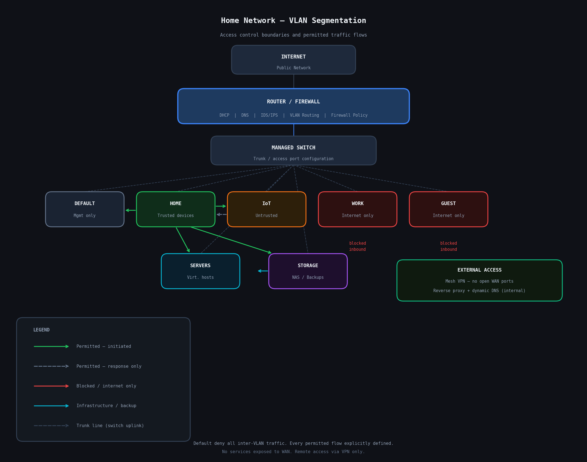

# Home Network Segmentation with VLANs

Designing and implementing a segmented home network using enterprise-grade managed hardware. This project covers threat-based VLAN design, firewall policy, and the hands-on troubleshooting process that came with getting it all working.

**Skills demonstrated:** Network segmentation, firewall policy, VLAN design, threat modeling, managed switching, network troubleshooting

---

## Why I Did This

My home network started as a flat network where everything sat on one subnet and could talk freely to everything else. That works fine until you think about what is actually on that network: laptops, phones, personal storage, and a pile of IoT devices from manufacturers who ship firmware updates on a "maybe never" schedule.

IoT devices are a particular concern. A cheap smart plug or IP camera from an unknown vendor is essentially an untrusted device. If it gets compromised, a flat network means it can reach everything else. Segmenting those devices into their own VLAN with no lateral movement to other subnets significantly reduces that risk.

Beyond IoT, I wanted a dedicated VLAN for a work laptop to keep work and personal traffic fully separated, and a guest network that could not touch anything internal.

---

## Network Hardware

| Device | Role |
|---|---|
| Managed Router | Router, firewall, DHCP, DNS, VLAN management |
| Managed Switch | Trunk and access port configuration |

---

## VLAN Design

Each VLAN uses a private RFC 1918 subnet. Addresses are omitted.

| VLAN Name | Purpose |
|---|---|
| Default | Management only, no end-user devices |
| Home | Trusted personal devices |
| IoT | Untrusted smart home and camera devices |
| Storage | Network storage, access tightly controlled |
| Servers | Virtualization hosts and self-hosted services |
| Work | Fully isolated, no internal access |
| Guest | Internet-only, no internal access |

The Default VLAN is reserved strictly for management traffic with no end-user devices assigned to it. This prevents general traffic from reaching infrastructure interfaces and avoids the common mistake of leaving devices on the default VLAN alongside networking equipment.

Storage sits in its own dedicated VLAN rather than sharing the server subnet. This allows explicit, granular rules about which VLANs can reach stored data rather than granting implicit access to anything in the server range.

---

## Firewall Policy

All inter-VLAN routing is denied by default. Access is explicitly permitted only where there is a documented reason.

Traffic from untrusted VLANs such as IoT and Guest is blocked from reaching any internal subnet. Trusted VLANs can initiate connections to IoT devices for smart home control, but IoT cannot initiate connections back. The Work VLAN is fully isolated in both directions. Storage is accessible only from trusted device VLANs and the server subnet for backup operations.

All rules are managed through the router's built-in firewall policy interface with custom rules applied on top for specific inter-VLAN flows.

---

## External Access

No services are exposed directly to the internet. There is no port forwarding on the WAN interface.

Remote access is handled through a mesh VPN solution that requires authentication and creates no open listening ports on the WAN side. There is nothing for an external scanner to find.

Internal services are accessible through a reverse proxy using a dynamic DNS provider for hostnames and valid HTTPS certificates. These are internal only. Reaching them remotely requires connecting through the VPN first.

---

## DNS

Internal DNS is handled by the router. Hostnames resolve correctly across permitted VLANs. Isolated VLANs receive DNS responses without gaining any additional internal access.

---

## Security Design Rationale

**Confidentiality** is protected by ensuring that sensitive systems are only reachable by VLANs with a legitimate reason to access them. Untrusted devices have no path to personal storage or primary systems. The work VLAN is fully isolated, preventing any cross-contamination between personal and work data.

**Integrity** is supported by restricting which devices can initiate connections to which systems. A compromised IoT device cannot reach storage or servers to modify or exfiltrate data. Default deny routing means no unintended communication path exists unless explicitly created.

**Availability** is addressed by segmenting failure domains. A misbehaving or compromised device on one VLAN cannot affect others. Separating management traffic from end-user VLANs also protects infrastructure availability.

**Least privilege** is applied at the network layer. Every VLAN can only reach what it needs and nothing else. Every permitted flow has a documented reason. There are no open-ended rules.

**Threat model:** The primary threats addressed are lateral movement from a compromised device, unauthorized access to stored data, and exposure of management interfaces to untrusted traffic. A flat network has no controls against any of these. VLAN segmentation with default deny firewall policy directly mitigates all three.

---

## What I Learned

- Sticking to one vendor ecosystem for managed switching eliminates a significant source of configuration complexity, especially when building intuition for how VLAN tagging works across devices.
- Trunk and access port configuration is a foundational concept that is easy to misunderstand in practice. Getting it wrong and tracing the failure is what made it stick.
- Default deny is the right starting point for any firewall policy. It is much easier to open specific permitted flows than to audit a permissive ruleset later.
- IoT isolation is not optional on any network with cheap connected devices. The threat is real and the mitigation cost is low.
- Reserving the default VLAN for management only removes ambiguity and keeps infrastructure traffic cleanly separated from everything else.

---

## See Also

- [TROUBLESHOOTING.md](TROUBLESHOOTING.md) - Detailed breakdown of issues encountered during setup
